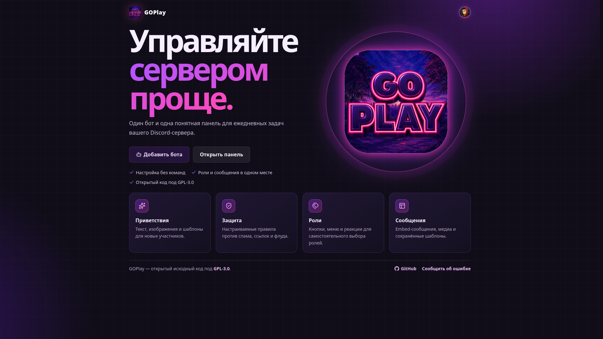
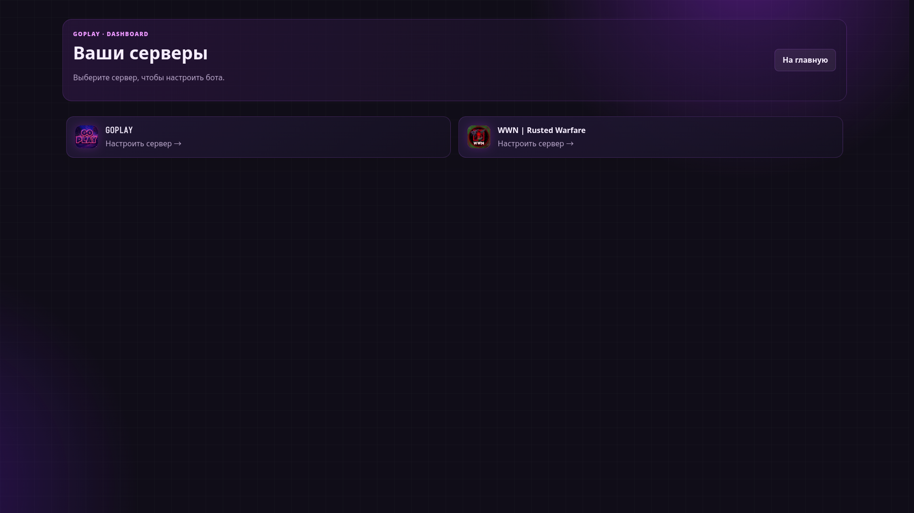
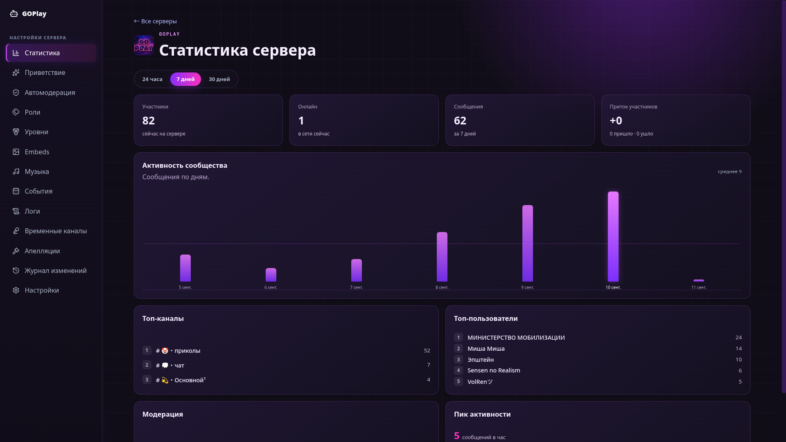

# GOPlay.bot

**Language: English | [Русский](README.ru.md)**

[](https://github.com/VolRencs/GOPlay.bot/actions/workflows/ci.yml)


Discord bot and server-management web dashboard in a single repository and a
single process: a `discord.js` bot + a `Next.js` dashboard with Discord OAuth login.
Stack (pinned in `package.json`): Node **≥ 26**, pnpm **12.4.1**, Next.js **16.3.4**,
React **19.3.0**, TypeScript **7.0.2**, Node's native TypeScript type stripping and
`node:sqlite` (no separate DB driver).

## Features

**Bot (slash commands, RU + EN localization):**
- Info: `play`, `ping`, `help`, `user`, `server`, `avatar`, `lvl`, `top`.
- Moderation: `ban`, `kick`, `timeout` / `untimeout`, `warn` / `warnings` / `clearwarn`,
  `purge`, `slowmode`, `lock` / `unlock` (moderation commands are administrator-only).

**Modules (configured from the dashboard, `/dashboard/[guildId]` tabs):**
| Tab | What it does |
|---|---|
| Stats | Members/online, channels, roles, activity |
| Welcome | Text + image for new members and farewells (templates like `{user}`, `{server}`, `{count}`…; rendered via resvg) |
| Automod | Rules against spam, links, invites, flooding and duplicates; ignored roles, protected channel, punishment escalation |
| Roles | Self-assignable roles via buttons, selects and reactions |
| Levels | XP for messages and voice time, anti-farm rules (cooldown, min length, 2+ members in voice), level reward roles, notifications to a channel or DMs; `/lvl` and `/top` commands |
| Embeds | Embed message builder, media attachments, templates |
| Music | YouTube in a voice channel: `yt-dlp → ffmpeg (libopus) → voice`; queue up to 50 tracks, playlists up to 100, 2 h length limit |
| Events | Event creation, participants, reminders |
| Logs | Modlog: joins/leaves, message edits/deletes, channels, bans, etc. |
| Temp channels | Private voice channels on joining a hub channel |
| Appeals | Punishment appeals via DM with buttons |
| Audit log | Who changed what in the dashboard |
| Settings | Bot language (RU/EN) and server parameters |

Plus: owner admin panel (`/admin`), Discord login (`better-auth`),
SQLite storage (`node:sqlite`, WAL), RU/EN bot i18n, `node --test` tests.

## Screenshots





## Quickstart (local)

Requirements: **Node ≥ 26**, **pnpm 12.4.1**, **ffmpeg with libopus**,
**yt-dlp** in PATH.

```bash
# 1. System dependencies (Debian/Ubuntu)
sudo apt install ffmpeg
ffmpeg -encoders | grep opus        # must find libopus
# yt-dlp: https://github.com/yt-dlp/yt-dlp#installation

# 2. Project dependencies
pnpm i --frozen-lockfile

# 3. Configuration
cp .env.example .env
# fill in .env (details in the .env.example header):
# DISCORD_TOKEN / DISCORD_CLIENT_ID / DISCORD_CLIENT_SECRET,
# BETTER_AUTH_SECRET (generate: openssl rand -base64 32),
# ADMIN_DISCORD_IDS (your Discord ID, otherwise /admin returns 403)

# 4. Discord Developer Portal (https://discord.com/developers/applications):
# - Bot → Reset Token → enable the Server Members and Message Content intents
# - OAuth2 → Redirects → http://localhost:3000/api/auth/callback/discord

# 5. Run (bot + web in one process, log at data/logs/bot.log)
pnpm migrate:auth && pnpm dev
# open http://localhost:3000
```

Pre-commit checks:

```bash
pnpm check   # tsc --noEmit
pnpm test    # node --test test/*.test.ts
```

## Environment variables

| Variable | Required | Purpose |
|---|---|---|
| `DISCORD_TOKEN` | required | Bot token; without it the bot process exits (`DISCORD_TOKEN is required`) |
| `DISCORD_CLIENT_ID` | required | OAuth + invite link on the landing page |
| `DISCORD_CLIENT_SECRET` | required | OAuth via Discord |
| `DATABASE_PATH` | optional | SQLite path, default `data/bot.sqlite` |
| `NEXT_PUBLIC_APP_URL` | optional | Public app URL (fallback for better-auth) |
| `BETTER_AUTH_URL` | required in prod | Canonical URL (`https://…` in production) |
| `BETTER_AUTH_SECRET` | required | Session secret; generate with `openssl rand -base64 32` |
| `DEBUG` | optional | `1` enables info logs, default `0` |
| `DASHBOARD_ALLOWED_DISCORD_IDS` | optional | Dashboard allowlist (empty = anyone managing the server) |
| `ADMIN_DISCORD_IDS` | needed for `/admin` | Owner IDs, comma-separated, otherwise 403 for everyone |
| `YT_DLP_PATH` | optional | Path to `yt-dlp` (defaults to PATH lookup) |
| `FFMPEG_PATH` | optional | Path to `ffmpeg` (defaults to PATH lookup) |
| `YT_DLP_EXTRA_ARGS` | optional | Extra yt-dlp flags, e.g. `--cookies /path/to/cookies.txt` |

Never commit `.env`, `cookies.txt`, `*.pem` / `*.key`.
Detailed instructions are in the [`.env.example`](.env.example) header.

## Scripts

| Command | What it does |
|---|---|
| `pnpm dev` | `migrate:auth` + `next dev` and the bot (`src/bot/index.ts`) via `scripts/run-both.ts`, log at `data/logs/bot.log` |
| `pnpm build` | `next build` |
| `pnpm start` | `migrate:auth` + `next start` and the bot via `scripts/run-both.ts`, log at `data/logs/bot.log` |
| `pnpm migrate:auth` | better-auth table migrations in the same SQLite |
| `pnpm logs:rotate` | moves `data/logs/bot.log` to `.1` when it exceeds 5 MB |
| `pnpm test` | `node --test test/*.test.ts` |
| `pnpm check` | `tsc --noEmit` |

## Project structure

```
app/                  Next.js App Router: landing, /dashboard, /admin,
                      /login, API (/api/guilds, /api/admin, /api/auth),
                      upload serving (/uploads/...)
src/bot/              Bot entry point (index.ts) + modules:
                      moderation, automod, appeals, logging,
                      tempchannels, music, events, levels, db, utils
src/db/               database.ts (node:sqlite, WAL) + migrations/*.sql
src/lib/              Shared logic: auth, guild-access, automod, welcome,
                      appeals, levels, uploads, player/* (yt-dlp/ffmpeg stack), i18n
src/components/       React: user-menu + dashboard/* (tab panels)
scripts/              migrate-auth.ts, run-both.ts (bot + web supervisor)
deploy/               nginx-ip-https.conf (reverse-proxy example)
test/                 *.test.ts (node --test)
data/                 SQLite, logs, uploads (not in git, except .gitkeep)
public/               bot-logo.png, fonts/, uploads/ (welcome backgrounds, not in git)
```

## Production

```bash
pnpm i --frozen-lockfile
pnpm build
pnpm start
```

- Set `BETTER_AUTH_URL` and `NEXT_PUBLIC_APP_URL` to `https://YOUR_DOMAIN`.
- In the Discord Portal, add the prod redirect `https://YOUR_DOMAIN/api/auth/callback/discord`.
- Keep Next bound only to `127.0.0.1:3000`, expose via nginx
  (example: [`deploy/nginx-ip-https.conf`](deploy/nginx-ip-https.conf),
  `client_max_body_size 8m`).
- Back up `data/bot.sqlite` (plus `-wal`/`-shm` alongside while running).
- `data/logs/bot.log` rotation happens automatically on start via `pnpm logs:rotate`.

## FAQ

- **`Sign in to confirm you're not a bot` on `/play`** — a YouTube restriction.
  Provide cookies: `YT_DLP_EXTRA_ARGS=--cookies /path/to/cookies.txt`
  (keep the file out of git).
- **`missingFfmpeg` / `missingOpus`** — install ffmpeg with libopus,
  or set `FFMPEG_PATH` / `YT_DLP_PATH` explicitly.
- **`/admin` returns 403** — fill in `ADMIN_DISCORD_IDS` with your Discord ID
  (Developer Mode → Copy User ID).
- **Self-assignable roles don't work** — the bot's role must be above the grantable
  roles in the server hierarchy (the bot logs a warning).
- **Paths with spaces in `YT_DLP_EXTRA_ARGS`** — not supported
  (naive whitespace split), use space-free paths.

## Contributing and security

- How to contribute: [`CONTRIBUTING.md`](CONTRIBUTING.md) ([Русский](CONTRIBUTING.ru.md)).
- Where to report vulnerabilities and leaked tokens: [`SECURITY.md`](SECURITY.md) ([Русский](SECURITY.ru.md)).

## License and attribution

Licensed under **GPL-3.0** — see [`LICENSE`](LICENSE).
Copyright (C) 2026 VolRen.

- `public/fonts/NotoSans-*.ttf` — Noto Sans under the SIL Open Font License.
- `public/bot-logo.png`, `app/icon.png` — original project assets.
